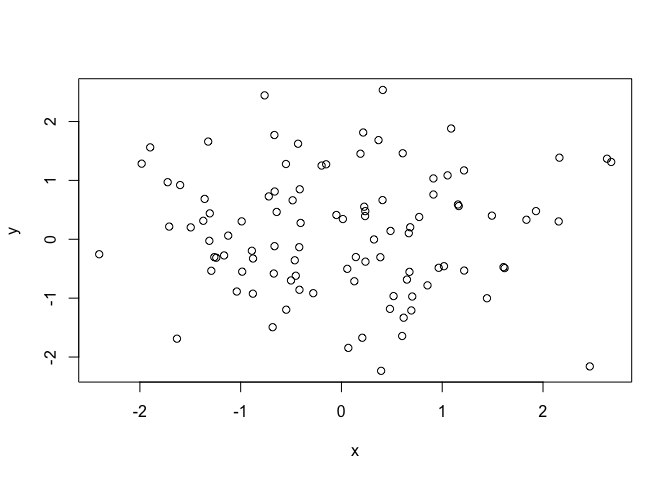
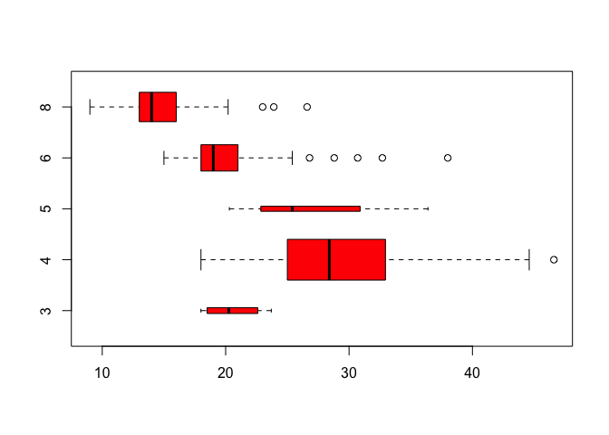
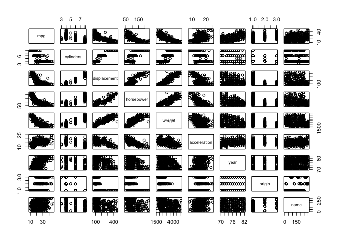

Introduction and Chp 2: Statistical Learning
================

Introduction
============

**Overview**

-   Supervised: prediction/estimation of outputs based on inputs
-   Unsupervised: inputs but no supervising outputs
-   Regression: continuous/discrete data
-   Classification: qualitative/categorical data
-   Clustering: no output; principal components

**History**

-   Method of Least Squares; Linear Regression: Legendre and Gauss
-   Linear Discriminant Analysis: Fisher
-   Logistic Regression: alternative to LDA
-   Generalized Linear Models: Nelder and Wedderburn class of methods including linear and logistic
-   Classification and Regression Trees: Breiman, Friedman, Olshen, and Stone (including cross-validation)
-   Generalized Additive Models: Hastie and Tibshirani, class of non-linear extensions to GLM

**Matrix Notation**

-   n is number of observations
-   p is number of variables
-   i is index of observations (i = 1, 2, ..., n)
-   j is index of variables (p = 1, 2, ..., p)
-   **X** denotes *n* × *p* matrix whose (*i*, *j*)th element is *x*<sub>*i*, *j*</sub>
-   vector of length n = **a**
-   vector of length of p or anything else = *x*
-   scalar = $a $
-   vector of length k = *a* ∈ ℝ<sup>*k*</sup>
-   $(\\textbf{AB})\_{ij} = \\sum\_{k=1}^d a\_{ik}b\_{kj}$

Statistical Learning
====================

What is Statistical Learning
----------------------------

*Y* = *f*(*X*)+*ϵ*

-   *f* is systematic information that X provides about Y
-   *ϵ* is error term --- independent of X and mean zero

### Prediction vs Inference

-   because error is zero on average, $\\hat{Y} = \\hat{f}(X)$
-   will always be some error because true Y is also a function of *ϵ* which by definition cannot be predicted by X
    -   *ϵ* may contain variables that are useful to predicting Y
    -   *ϵ* is upper bound on accuracy

$$
    \\begin{equation}
    \\begin{split}
        E\[(Y - \\hat{Y})^2\] &= E\[(f(X) + \\epsilon - \\hat{f}(X))^2\]\\\\
        &= \\underset{Reducible}{\[f(X) - \\hat{f}(X)\]^2} + \\underset{Irreducible}{Var(\\epsilon)}
    \\end{split}
    \\end{equation}
$$

-   Prediction: X is easy to obtain by Y is not; use X to find Y
    -   $\\hat{f}$ is a black box; interested just in reducing the reducible error
-   Understand how changes in X affect Y
    -   $\\hat{f}$ is no longer a black box; need to know the form

### Parametric vs Non-Parametric

Want to find a function $\\hat{f}$ such that $Y (X) $ for any observation (X,Y)

-   Parametric models
    -   1.  Make assumption about functional form
    -   1.  Need procedure that uses data to fit/train model
    -   called parametric b/c it reduces problem of estimating *f* down to just estimating a set of parameters
    -   often model chosen is not a perfect fit; but adding more parameters to smooth the fit will follow the errors and overfit

-   Non-parametric
    -   does not make explicit assumptions about the form of *f*
    -   can accurately fit a wider range of possible shapes of *f*
    -   however, need a large number of obs for accurate estimation

### Accuracy vs Interpretability

-   List descending Interpretability and Ascending Flexibility
    -   Subset Selection Lasso
    -   Least Squares
    -   Generalized Additive Models/Trees
    -   Bagging, Boosting
    -   Support Vector Machines

### Supervised vs Unsupervised Learning

Supervised: fit model that relates response to predictors for purposes of predictors or inference

Unsupervised: no associated y for vector of x \* if there are p variables then there are *p*(*p* − 1)/2 scatter plots possible

### Regression vs Classification

Classification used more for qualitative variables

Assessing Model Accuracy
------------------------

### Measuring Quality of Fit

Need to quantify how close predicted value is to true response value; most common is mean squared error

$$
    MSE = \\frac{1}{n} \\sum\_{i=1}^n (y\_i - \\hat{f}(x\_i))^2
$$

-   squared diff between observed and predicted Y
-   above equation is *training MSE* because it is from the training data; interested in MSE for unseen data; really interested in lowest *test MSE*
-   **degrees of freedom** summarizes flexibility of a curve
-   very low training MSE will often have high test MSE; can use cross-validation to help-control for this

### Bias Variance Tradeoff

Differences between low training MSE and high test MSE is function of bias-variance tradeoff; can decompose MSE into:

$$
    E\[y\_0 - \\hat{f}(x\_0)\]^2 = Var\[\\hat{f}(x\_0)\] + \[Bias(\\hat{f}(x\_0))\]^2 + Var(\\epsilon)
$$

-   expected test MSE: $E\[y\_0 - \\hat{f}(x\_0)\]^2$; is what we would obtain if repeatedly estimated *f*
-   expected test MSE can never lie below *V**a**r*(*ϵ*)
-   Variance: how much $\\hat{f}$ would change if estimated using different data
    -   overfitted model will change greatly if data is changed
-   Bias: error from model selection; more flexible leads to less bias
-   More flexible models: lower bias increased variance
-   Good test set performance of statistical learning method requires low variance and low squared bias

<!-- some code to generate the bias, var MSE graph -->
### Classification Setting

Measure accuracy of classification using *error rate*: proportion of mistakes made when applying $\\hat{f}$ to training data; *training error*:

$$
    \\frac{1}{n} \\sum\_{i=1}^n I(y\_i \\neq \\hat{y}\_i)
$$

-   *I* is an indicator equal to 1 if they are not the same (≠) and 0 otherwise

-   corresponding *test error* is:
    $$
    Ave(I(y\_0 \\neq \\hat{y}\_0))
    $$

-   a good classifier is one wher the test error is smallest

**Bayes Classifier**

On average minimum test error rate is given by classifier that assigns each obs to most likely class conditional on its predictor values --- This is the Bayes Classifier

-   simply assign a test observation with predictor vector *x*<sub>0</sub> to class *j* for which *P**r*(*Y* = *j*|*X* = *x*<sub>0</sub>) is largest
-   Example:
    -   if two classes, Bayes classifier predicts class one if *P**r*(*Y* = 1|*X* = *x*<sub>0</sub>)&gt;0.5
    -   where probabilit is equalt to 50% is Bayes Decision Boundary
-   Bayes Error Rate: test error rate for classifiers
-   Bayes classifier produces smallest possible test error rate
-   Overall Bayes Error Rate is:
    1 − *E*\[max<sub>*j*</sub>*P**r*(*Y* = *j*|*X*)\]

**K-Nearest Neighbor**

Cannot compute Bayes Classifier for real data b/c we don't know the conditional distribution of Y given X; can estimate *Y*|*x* and then classify obs based on highest *estimated* probability; one example is KNN:

-   With positive integer *K* and test observation *x*<sub>0</sub>, KNN identifies *K* points in data closest to *x*<sub>0</sub>; points represented by *N*<sub>0</sub>
-   Then estimate conditional probability for class *j* as fraction of points in *N*<sub>0</sub> whose response values equal *j*:

$$
    Pr(Y = j \\vert X = x\_0) = \\frac{1}{K} \\sum\_{i \\in N\_0} I(y\_i = j)
$$

-   Then applies Bayes rule and classifies test obs

<!-- example is great in the book; need code for simulation -->
Lab: Introduction to R
----------------------

``` r
# Chapter 2 Lab: Introduction to R

# Load ISLR library for data
library(ISLR)

# Basic Commands

x <- c(1,3,2,5)
x
```

    ## [1] 1 3 2 5

``` r
x = c(1,6,2)
x
```

    ## [1] 1 6 2

``` r
y = c(1,4,3)
length(x)
```

    ## [1] 3

``` r
length(y)
```

    ## [1] 3

``` r
x+y
```

    ## [1]  2 10  5

``` r
ls()
```

    ## [1] "x" "y"

``` r
rm(x,y)
ls()
```

    ## character(0)

``` r
rm(list=ls())
?matrix
x=matrix(data=c(1,2,3,4), nrow=2, ncol=2)
x
```

    ##      [,1] [,2]
    ## [1,]    1    3
    ## [2,]    2    4

``` r
x=matrix(c(1,2,3,4),2,2)
matrix(c(1,2,3,4),2,2,byrow=TRUE)
```

    ##      [,1] [,2]
    ## [1,]    1    2
    ## [2,]    3    4

``` r
sqrt(x)
```

    ##          [,1]     [,2]
    ## [1,] 1.000000 1.732051
    ## [2,] 1.414214 2.000000

``` r
x^2
```

    ##      [,1] [,2]
    ## [1,]    1    9
    ## [2,]    4   16

``` r
x=rnorm(50)
y=x+rnorm(50,mean=50,sd=.1)
cor(x,y)
```

    ## [1] 0.9957669

``` r
set.seed(1303)
rnorm(50)
```

    ##  [1] -1.1439763145  1.3421293656  2.1853904757  0.5363925179  0.0631929665
    ##  [6]  0.5022344825 -0.0004167247  0.5658198405 -0.5725226890 -1.1102250073
    ## [11] -0.0486871234 -0.6956562176  0.8289174803  0.2066528551 -0.2356745091
    ## [16] -0.5563104914 -0.3647543571  0.8623550343 -0.6307715354  0.3136021252
    ## [21] -0.9314953177  0.8238676185  0.5233707021  0.7069214120  0.4202043256
    ## [26] -0.2690521547 -1.5103172999 -0.6902124766 -0.1434719524 -1.0135274099
    ## [31]  1.5732737361  0.0127465055  0.8726470499  0.4220661905 -0.0188157917
    ## [36]  2.6157489689 -0.6931401748 -0.2663217810 -0.7206364412  1.3677342065
    ## [41]  0.2640073322  0.6321868074 -1.3306509858  0.0268888182  1.0406363208
    ## [46]  1.3120237985 -0.0300020767 -0.2500257125  0.0234144857  1.6598706557

``` r
set.seed(3)
y=rnorm(100)
mean(y)
```

    ## [1] 0.01103557

``` r
var(y)
```

    ## [1] 0.7328675

``` r
sqrt(var(y))
```

    ## [1] 0.8560768

``` r
sd(y)
```

    ## [1] 0.8560768

``` r
# Graphics

x=rnorm(100)
y=rnorm(100)
plot(x,y)
```



``` r
plot(x,y,xlab="this is the x-axis",ylab="this is the y-axis",main="Plot of X vs Y")
```


``` r
pdf("Figure.pdf")
plot(x,y,col="green")
dev.off()
```

    ## quartz_off_screen 
    ##                 2

``` r
x=seq(1,10)
x
```

    ##  [1]  1  2  3  4  5  6  7  8  9 10

``` r
x=1:10
x
```

    ##  [1]  1  2  3  4  5  6  7  8  9 10

``` r
x=seq(-pi,pi,length=50)
y=x
f=outer(x,y,function(x,y)cos(y)/(1+x^2))
contour(x,y,f)
contour(x,y,f,nlevels=45,add=T)
```


``` r
fa=(f-t(f))/2
contour(x,y,fa,nlevels=15)
```


``` r
image(x,y,fa)
```


``` r
persp(x,y,fa)
```


``` r
persp(x,y,fa,theta=30)
```


``` r
persp(x,y,fa,theta=30,phi=20)
```


``` r
persp(x,y,fa,theta=30,phi=70)
```


``` r
persp(x,y,fa,theta=30,phi=40)
```


``` r
# Indexing Data

A=matrix(1:16,4,4)
A
```

    ##      [,1] [,2] [,3] [,4]
    ## [1,]    1    5    9   13
    ## [2,]    2    6   10   14
    ## [3,]    3    7   11   15
    ## [4,]    4    8   12   16

``` r
A[2,3]
```

    ## [1] 10

``` r
A[c(1,3),c(2,4)]
```

    ##      [,1] [,2]
    ## [1,]    5   13
    ## [2,]    7   15

``` r
A[1:3,2:4]
```

    ##      [,1] [,2] [,3]
    ## [1,]    5    9   13
    ## [2,]    6   10   14
    ## [3,]    7   11   15

``` r
A[1:2,]
```

    ##      [,1] [,2] [,3] [,4]
    ## [1,]    1    5    9   13
    ## [2,]    2    6   10   14

``` r
A[,1:2]
```

    ##      [,1] [,2]
    ## [1,]    1    5
    ## [2,]    2    6
    ## [3,]    3    7
    ## [4,]    4    8

``` r
A[1,]
```

    ## [1]  1  5  9 13

``` r
A[-c(1,3),]
```

    ##      [,1] [,2] [,3] [,4]
    ## [1,]    2    6   10   14
    ## [2,]    4    8   12   16

``` r
A[-c(1,3),-c(1,3,4)]
```

    ## [1] 6 8

``` r
dim(A)
```

    ## [1] 4 4

``` r
# Loading Data

Auto = Auto
dim(Auto)
```

    ## [1] 392   9

``` r
Auto[1:4,]
```

    ##   mpg cylinders displacement horsepower weight acceleration year origin
    ## 1  18         8          307        130   3504         12.0   70      1
    ## 2  15         8          350        165   3693         11.5   70      1
    ## 3  18         8          318        150   3436         11.0   70      1
    ## 4  16         8          304        150   3433         12.0   70      1
    ##                        name
    ## 1 chevrolet chevelle malibu
    ## 2         buick skylark 320
    ## 3        plymouth satellite
    ## 4             amc rebel sst

``` r
Auto=na.omit(Auto)
dim(Auto)
```

    ## [1] 392   9

``` r
names(Auto)
```

    ## [1] "mpg"          "cylinders"    "displacement" "horsepower"  
    ## [5] "weight"       "acceleration" "year"         "origin"      
    ## [9] "name"

``` r
# Additional Graphical and Numerical Summaries
attach(Auto)
plot(cylinders, mpg)
```


``` r
cylinders=as.factor(cylinders)
plot(cylinders, mpg)
```


``` r
plot(cylinders, mpg, col="red")
```


``` r
plot(cylinders, mpg, col="red", varwidth=T)
```


``` r
plot(cylinders, mpg, col="red", varwidth=T,horizontal=T)
```



``` r
plot(cylinders, mpg, col="red", varwidth=T, xlab="cylinders", ylab="MPG")
```


``` r
hist(mpg)
```


``` r
hist(mpg,col=2)
```


``` r
hist(mpg,col=2,breaks=15)
```


``` r
pairs(Auto)
```



``` r
pairs(~ mpg + displacement + horsepower + weight + acceleration, Auto)
```


``` r
plot(horsepower,mpg)
identify(horsepower,mpg,name)
```


    ## integer(0)

``` r
summary(Auto)
```

    ##       mpg          cylinders      displacement     horsepower   
    ##  Min.   : 9.00   Min.   :3.000   Min.   : 68.0   Min.   : 46.0  
    ##  1st Qu.:17.00   1st Qu.:4.000   1st Qu.:105.0   1st Qu.: 75.0  
    ##  Median :22.75   Median :4.000   Median :151.0   Median : 93.5  
    ##  Mean   :23.45   Mean   :5.472   Mean   :194.4   Mean   :104.5  
    ##  3rd Qu.:29.00   3rd Qu.:8.000   3rd Qu.:275.8   3rd Qu.:126.0  
    ##  Max.   :46.60   Max.   :8.000   Max.   :455.0   Max.   :230.0  
    ##                                                                 
    ##      weight      acceleration        year           origin     
    ##  Min.   :1613   Min.   : 8.00   Min.   :70.00   Min.   :1.000  
    ##  1st Qu.:2225   1st Qu.:13.78   1st Qu.:73.00   1st Qu.:1.000  
    ##  Median :2804   Median :15.50   Median :76.00   Median :1.000  
    ##  Mean   :2978   Mean   :15.54   Mean   :75.98   Mean   :1.577  
    ##  3rd Qu.:3615   3rd Qu.:17.02   3rd Qu.:79.00   3rd Qu.:2.000  
    ##  Max.   :5140   Max.   :24.80   Max.   :82.00   Max.   :3.000  
    ##                                                                
    ##                  name    
    ##  amc matador       :  5  
    ##  ford pinto        :  5  
    ##  toyota corolla    :  5  
    ##  amc gremlin       :  4  
    ##  amc hornet        :  4  
    ##  chevrolet chevette:  4  
    ##  (Other)           :365

``` r
summary(mpg)
```

    ##    Min. 1st Qu.  Median    Mean 3rd Qu.    Max. 
    ##    9.00   17.00   22.75   23.45   29.00   46.60
